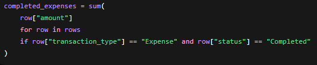
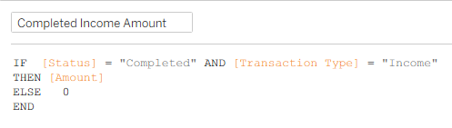
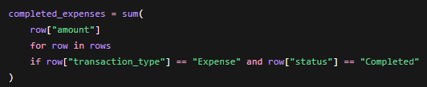
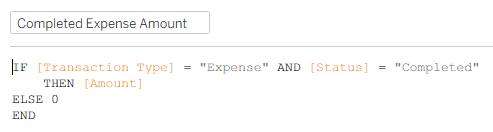
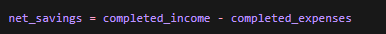
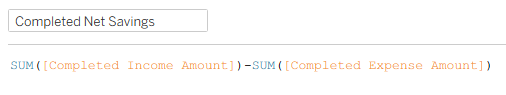
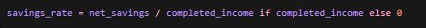
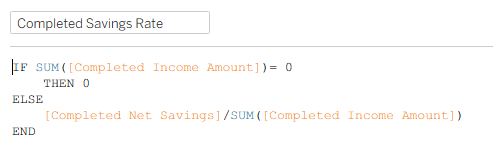

# Validation Checks

This document records validation checks used to confirm that the Tableau dashboard calculations match the generated synthetic CSV dataset.

## Validation Purpose

The goal of validation is to ensure that the Tableau dashboards display accurate totals based on the underlying `transactions.csv` file.

The dashboard should not only look correct visually, but also match the expected calculation logic.

## Source of Truth

The Python data generation script prints summary totals after generating the dataset, whilst summary totals on Tableau are evaluated through the formulas below:

##### Completed Income

**Python logic**

**Tableau logic**

---

##### Completed Expenses

**Python logic**

**Tableau logic**

---

##### Net Savings

**Python logic**

**Tableau logic**

---

##### Savings Rate

**Python logic**

**Tableau logic**

#### Validation Results
| Metric | Python Output | Tableau Output | Status |
|---|---:|---:|---|
| Completed Income | S$48,651.67 | S$48,652 | Pass |
| Completed Expenses | S$22,789.77 | S$22,790 | Pass |
| Net Savings | S$25,861.90 | S$25,862 | Pass |
| Savings Rate | 53.2%| 53.2% | Pass |